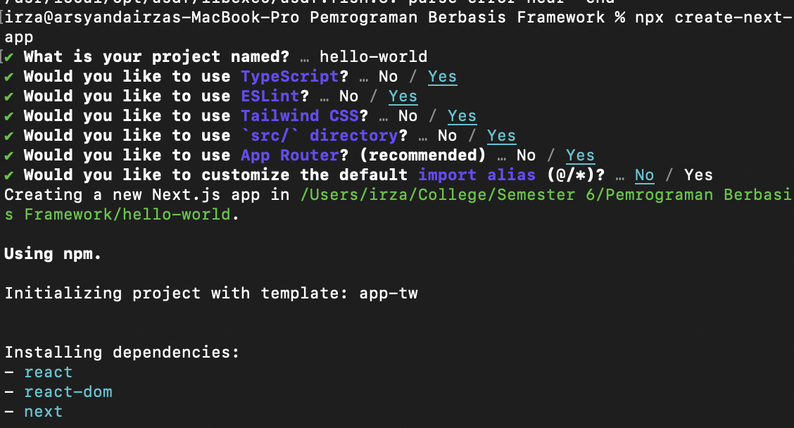
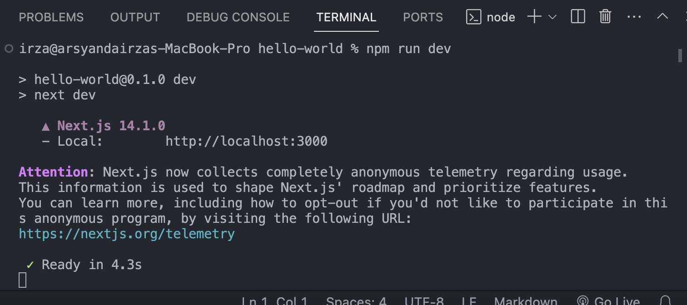

```
Nama  : Arsyanda Irza Rabbani Yuardhino
NIM   : 2141720245
Kelas : 3C
```

## Tugas Praktikum
 1. Buatlah repository di akun GitHub Anda dengan nama **#02-react-hello-world** kemudian kumpulkan link tersebut ke dosen pengampu sesuai media yang disepakati.
 2. Hapus isi file README.md yang ada di project hello-world tersebut, kemudian isi dengan jawaban praktikum mulai dari soal 1 hingga 3.
 3. Jangan lupa push project dan jawaban Anda melalui VS Code dengan pesan commit "Week 02: belajar react"
 4. Cobalah buat project react lainnya dengan menggunakan framework Remix dan Gatsby. Ini tidak perlu di push, cukup screenshot dan jelaskan perbedaannya diantara ketiga framework tersebut (termasuk Next.js) di file README nomor 1.

 ## Jawab
 ### Langkah 2: Buat project baru
 
```
Soal 1
Pada gambar tersebut, silakan Anda browsing apa yang dimaksud dengan:

- TypeScript
- ESLint
- Tailwind CSS
- App Router
- Import alias

```

**TypeScript** : TypeScript adalah bahasa pemrograman open source yang dibangun di atas JavaScript. Bahasa ini menambahkan beberapa fitur baru ke JavaScript, seperti sistem tipe statis, untuk membantu pengembang menulis kode yang lebih kuat, terstruktur, dan mudah dibaca.

**ESLint** : ESLint adalah alat open-source yang digunakan untuk menganalisis kode JavaScript dan mengidentifikasi pola bermasalah. ESLint dapat membantu pengembang menulis kode yang lebih konsisten, terstruktur, dan mudah dibaca.

**Tailwind CSS** : Tailwind CSS adalah kerangka kerja CSS berbasis utility-first yang dirancang untuk mempermudah dan mempercepat pembuatan aplikasi web dengan desain kustom.

 Berbeda dengan kerangka kerja CSS lainnya seperti Bootstrap atau Bulma, Tailwind CSS tidak menyediakan komponen UI siap pakai. Sebaliknya, Tailwind CSS menyediakan sekumpulan kelas utilitas yang dapat digabungkan untuk membangun desain UI apa pun.

**App Router** : App Router dapat merujuk kepada beberapa hal, tergantung pada konteksnya:

 1. Next.js App Router:

 Next.js App Router adalah fitur baru yang diperkenalkan di Next.js 13. Fitur ini memungkinkan Anda untuk:

  - Mendefinisikan rute aplikasi Anda di satu tempat: Anda dapat mendefinisikan semua rute aplikasi Anda di satu file, yaitu app/routes.tsx.
 - Menggunakan middleware: Anda dapat menggunakan middleware untuk melakukan tindakan sebelum atau setelah permintaan diproses.
 - Membuat halaman dinamis: Anda dapat membuat halaman dinamis dengan menggunakan parameter rute.
 - Menggunakan navigasi klien: Anda dapat menggunakan navigasi klien untuk menavigasi antar halaman aplikasi Anda tanpa memuat ulang halaman.

 2. React Router:

 React Router adalah pustaka populer yang digunakan untuk routing dalam aplikasi React. React Router memungkinkan Anda untuk:

 - Mendefinisikan rute aplikasi Anda: Anda dapat mendefinisikan semua rute aplikasi Anda di satu file, yaitu routes.js.
 - Menggunakan navigasi klien: Anda dapat menggunakan navigasi klien untuk menavigasi antar halaman aplikasi Anda tanpa memuat ulang halaman.
 - Membuat halaman dinamis: Anda dapat membuat halaman dinamis dengan menggunakan parameter rute.
 - Menambahkan transisi animasi: Anda dapat menambahkan transisi animasi saat beralih antar halaman.

- Import alias : Import alias adalah fitur dalam bahasa pemrograman yang memungkinkan Anda untuk memberikan nama baru untuk modul atau variabel yang diimpor.

 Manfaat menggunakan import alias:

 - Meningkatkan keterbacaan kode: Import alias dapat membuat kode Anda lebih mudah dibaca dan dipahami dengan memberikan nama yang lebih deskriptif untuk modul atau variabel yang diimpor.
 - Menghindari konflik nama: Import alias dapat membantu Anda menghindari konflik nama antara modul atau variabel yang diimpor dari modul yang berbeda.
 - Membuat kode lebih ringkas: Import alias dapat membantu Anda membuat kode Anda lebih ringkas dengan mengganti nama modul atau variabel yang panjang dengan nama yang lebih pendek.

```
Soal 2: Pada struktur project tersebut, jelaskan kegunaan folder dan file masing-masing tersebut!

 - Git : 
 - node_modules
 - public
 - src 
 - .eslintrc.json
 - .gitignore
 - next.config.mjs
 - next-env.d.ts
 - package.json
 - package-lock.json
 - postcss.config.js
 - README.md
 - tailwind.config.ts
 - tsconfig.json
```

## Jawab
 - Git : Folder ini digunakan oleh sistem kontrol versi Git untuk menyimpan semua informasi terkait dengan repositori Git Anda. Folder ini berisi metadata, log, konfigurasi, dan riwayat perubahan yang terjadi dalam repositori Git.

 - node_modules : Folder ini berisi semua paket dan dependensi yang dibutuhkan oleh proyek tersebut. Ketika Anda menginstal paket-paket menggunakan npm atau yarn, paket-paket tersebut akan diunduh dan disimpan di dalam folder

 - public : Folder ini digunakan untuk menyimpan berkas-berkas statis seperti gambar, file CSS, file JavaScript, dan file lainnya yang akan digunakan dalam aplikasi web Anda. Berkas-berkas yang disimpan di dalam folder public ini dapat diakses secara langsung oleh browser tanpa perlu melalui proses kompilasi atau pengolahan oleh Next.js.

 - src : Folder src tidak memiliki fungsi khusus yang ditentukan oleh Next.js. Folder src biasanya digunakan untuk menyimpan berkas-berkas kode sumber aplikasi web, seperti komponen React, halaman, utilitas, layanan, dan berkas-berkas lain yang dibutuhkan dalam pengembangan aplikasi.

 - .eslintrc.json :  File ini digunakan untuk mengkonfigurasi ESLint, yaitu alat linting JavaScript yang membantu dalam mengidentifikasi dan memperbaiki potensi kesalahan dalam kode JavaScript

 - .gitignore :  File ini digunakan untuk menentukan berkas-berkas atau folder-folde yang tidak ingin diikutsertakan dalam repositori Git.

 - next.config.mjs :  File ini digunakan untuk mengkonfigurasi berbagai pengaturan khusus dalam proyek Next.js, seperti pengaturan server, pengaturan webpack, pengaturan routing, dan pengaturan lainnya yang tidak dapat diatur melalui opsi konfigurasi bawaan Next.js.

 - next-env.d.ts : File definisi tipe TypeScript untuk variabel lingkungan spesifik Next.js, yang membantu dalam pengetikan.

 - package.json : File manifes JSON yang berisi metadata proyek Anda, termasuk dependensi, skrip, dan pengaturan build.

 - package-lock.json : File yang dihasilkan oleh npm saat memasang dependensi, mencatat versi terenkripsi dari semua dependensi untuk memastikan reproduktifitas.

 - postcss.config.js : Konfigurasi untuk PostCSS, sebuah prosesor stylesheet yang memungkinkan Anda menggunakan plugin untuk mengolah CSS Anda.

 - README.md : File teks yang menyediakan deskripsi proyek, instruksi instalasi, dan panduan penggunaan umum.

 - tailwind.config.ts : Konfigurasi untuk Tailwind CSS, framework utility-first untuk membangun desain UI.

 - tsconfig.json : Konfigurasi untuk TypeScript, superset JavaScript yang menambahkan fitur pengetikan statis untuk meningkatkan keakuratan dan keterbacaan kode.

 ### Langkah 4: Run
 
```
 Soal 3: Ketika Anda telah berhasil mengganti teks tersebut, Anda tidak perlu menjalankan perintah npm run dev dan tidak juga diperlukan me-reload halaman di browser. Tiba-tiba perubahan itu tampil, Mengapa terjadi demikian? Jelaskan!
```
## Jawab

Ada beberapa kemungkinan mengapa perubahan teks pada project Next.js langsung tampil tanpa perlu menjalankan **npm run dev** atau **me-reload** halaman di browser:

 1. Hot Module Replacement (HMR):

 Next.js mendukung HMR, yang memungkinkan Anda melihat perubahan pada kode Anda secara langsung di browser tanpa perlu memuat ulang halaman. Saat Anda mengubah file JavaScript atau CSS, HMR akan secara otomatis mendeteksi perubahan dan memperbarui browser Anda.

 2. Server-Side Rendering (SSR):

 Next.js dapat merender HTML, CSS, dan JavaScript di server sebelum mengirimkannya ke browser. Saat Anda mengubah teks, SSR akan merender ulang halaman dengan teks baru dan mengirimkannya ke browser.

 3. Static Site Generation (SSG):

 Jika Anda menggunakan SSG, Next.js akan membangun situs web statis Anda terlebih dahulu. Saat Anda mengubah teks, Next.js akan membangun kembali situs web statis dengan teks baru.